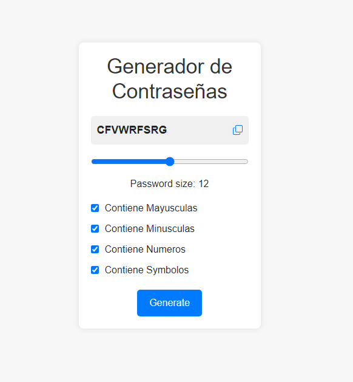

# Generador de Contraseñas

Este proyecto consiste en generar contraseñas automaticamente donde el usuario podrá seleccionar que debe incluir las contraseña generada

## Captura de pantalla

## Funcionalidades

- Muestra la contraseña generada al dar click en genetate.
- Seleccionar opciones deseadas como Mayusculas, Minusculas, Numeros, Simbolos.
- Selecciona el tamaño de la contraseña a generar
- Interfaz minimalista y fácil de usar.
- Puede copiar la contraseña con el icono copy

## Uso
Simplemente abre el archivo `index.html` en tu navegador.

## Tecnologías utilizadas

- HTML5
- CSS3
- JavaScript